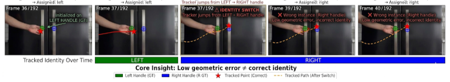
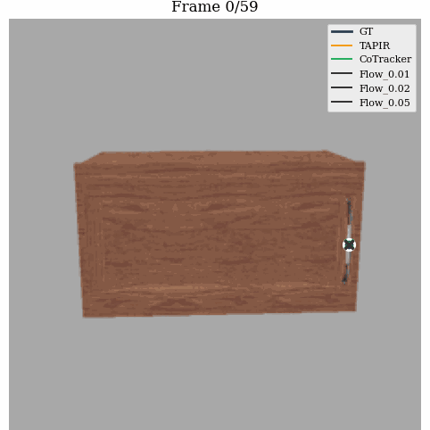
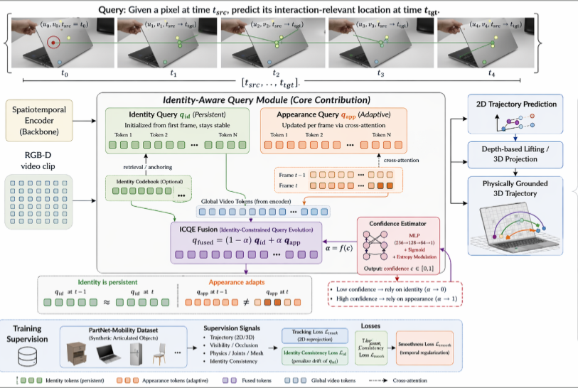
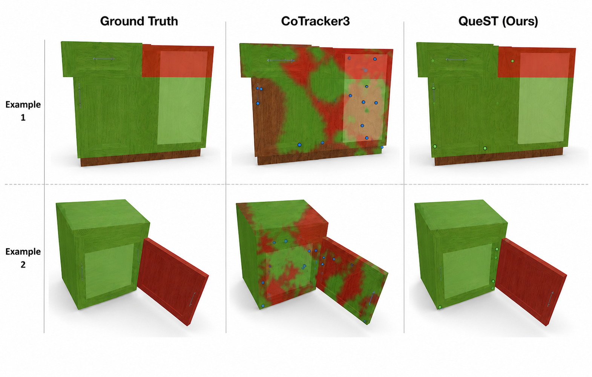
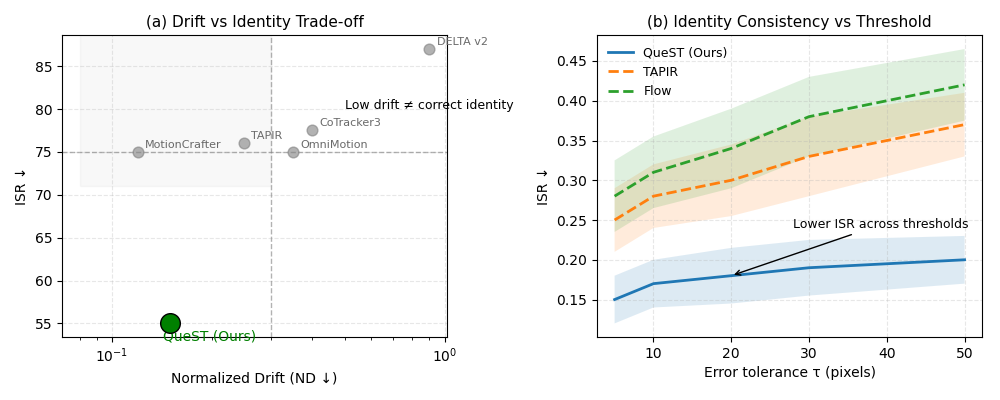
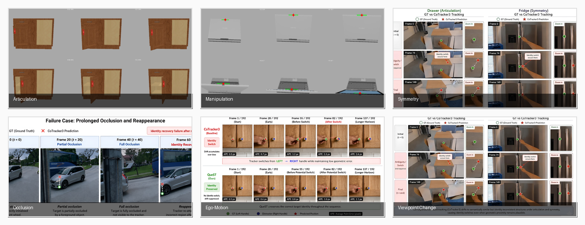
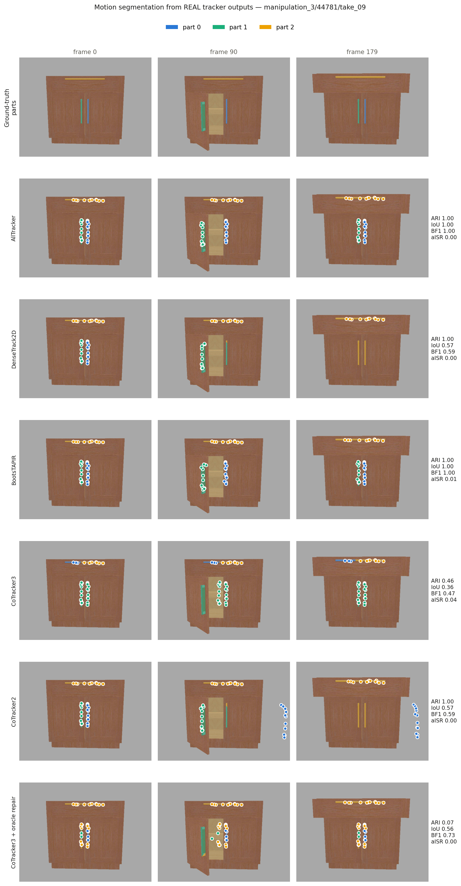

<div align="center">

# QueST: Identity-Aware Query-Based Point Tracking under Ambiguity

**Official code for *Identity Matters: Identity-Aware Query-Based Point Tracking under Ambiguity***
*Submitted to NeurIPS 2026*

</div>

<p align="center">
  
</p>

<p align="center">
  
</p>

Point trackers can look geometrically perfect while silently tracking the
*wrong physical point* — a tracker jumps from the left handle to the right
one, stays smooth, and every standard metric (APE, endpoint error) still
looks fine. This repo evaluates that failure mode directly with an
**Identity Switch Rate (ISR)** metric, provides the **EgoTrajFlow**-style
benchmark and dataset-generation pipeline used to expose it, and includes
the **QueST** tracker architecture proposed to address it.

---

## Contents

- [What's here](#whats-here)
- [Highlights](#highlights)
- [Repository structure](#repository-structure)
- [Dataset](#dataset)
- [Checkpoints](#checkpoints)
- [Installation](#installation)
- [Quick start](#quick-start)
- [Results](#results)
- [License](#license)

## What's here

This release is organized around two things, kept deliberately separate:

1. **The ISR metric and its downstream validation** (`benchmark/`,
   `downstream_causal/`) — evidence that identity preservation, measured by
   ISR, predicts and *causes* downstream task quality (motion segmentation,
   articulated-part consistency), evaluated entirely on standard
   off-the-shelf trackers. This is the strongest, most rigorously validated
   part of the release.
2. **The QueST architecture** (`quest/`) — the identity-aware tracker
   proposed in the paper, plus follow-on work extending the same metric to
   an interactive human-correction setting (`interactive_repair/`) and to
   frozen video world-model representations (`worldmodel_eval/`).

## Highlights

<p align="center">
  
</p>

- **ISR carries real, statistically significant downstream signal beyond
  geometric metrics** — adding ISR to a regression already containing
  APE/OA/drift produces a significant ΔR² for segmentation IoU, ARI,
  boundary F1, and articulated consistency (all p < 0.005), measured across
  5 architecturally distinct off-the-shelf trackers.
- **Identity switches causally degrade downstream quality at *matched*
  geometric error** — injecting identity switches while holding APE
  constant (switch vs. APE-matched drift) significantly hurts articulated
  consistency and boundary F1, isolating identity confusion from generic
  tracking noise.
- **Automatic identity repair recovers downstream quality on real tracker
  mistakes** — an automatic corrector reduced ISR in 20/20 real,
  naturally-occurring switch cases and improved segmentation IoU in 18/20
  (p = 0.0014).

See [`downstream_causal/results/CONSOLIDATED_REPORT.md`](downstream_causal/results/CONSOLIDATED_REPORT.md)
for full results, statistics, and honestly-reported limitations.

<p align="center">
  
</p>

<p align="center">
  
</p>

## Repository structure

```
quest/                   QueST model (Sec. 3 of the paper) — see quest/README.md
benchmark/                ISR / ISR-AUC metric + downstream segmentation & articulated-consistency eval
dataset_prep/              PartNet-Mobility -> SAPIEN dataset generation pipeline (code only)
downstream_causal/          causal validation of ISR (correlation, intervention, real-repair experiments)
interactive_repair/          SEMAPHORE human-in-the-loop repair platform + automatic identity corrector
worldmodel_eval/              probe: does identity preservation matter for frozen video world-model features?
assets/                        figures/media used in this README
```

Each subfolder has its own README with file-by-file detail.

## Dataset

<p align="center">
  
</p>

The synthetic articulated benchmark (generated with `dataset_prep/`) is
released as a Hugging Face dataset. The link is withheld here during
anonymous review; set `QUEST_DATASET_REPO` to the dataset's repo id once
you have it (see `downstream_causal/download_subset.py`):

```python
import os
from huggingface_hub import snapshot_download
snapshot_download(os.environ["QUEST_DATASET_REPO"], repo_type="dataset")
```

The real-world egocentric component of EgoTrajFlow is built from Ego4D and
ITTO-compatible footage; both require obtaining access under their own
licenses (not redistributed here).

## Checkpoints

No trained weights are hosted in this repository. Checkpoints referenced
by the code come from each method's official release:

| Model | Source |
|---|---|
| CoTracker2 / CoTracker3 | [facebookresearch/co-tracker](https://github.com/facebookresearch/co-tracker) |
| TAPIR / BootsTAPIR | [google-deepmind/tapnet](https://github.com/google-deepmind/tapnet) |
| V-JEPA2 | [facebookresearch/vjepa2](https://github.com/facebookresearch/vjepa2) / [HF: facebook/vjepa2-vitl-fpc64-256](https://huggingface.co/facebook/vjepa2-vitl-fpc64-256) |
| DINOv2 | [HF: facebook/dinov2-base](https://huggingface.co/facebook/dinov2-base) |
| nnInteractive | [MIC-DKFZ/nnInteractive](https://github.com/MIC-DKFZ/nnInteractive) (weights: [HF: nnInteractive/nnInteractive](https://huggingface.co/nnInteractive/nnInteractive), CC BY-NC-SA 4.0) |

Point each script's corresponding environment variable at your local copy
(see each subfolder's README).

## Installation

```bash
git clone https://github.com/facebookresearch/co-tracker.git
# copy the files in quest/ into the paths noted in quest/README.md
pip install -r requirements.txt   # standard scientific-python stack + torch, scikit-learn, opencv-python
```

`downstream_causal/`, `interactive_repair/`, and `worldmodel_eval/` are
independent, importable packages — see each one's README/docstrings for
its specific dependencies (e.g. `worldmodel_eval` needs a recent
`transformers` for `VJEPA2Model`).

## Quick start

```bash
# ISR + downstream metrics on a tracked sequence
python -m downstream_causal.run_matrix --data-root <path-to-dataset> --trackers cotracker3

# switch-injection causal experiment (E2)
python -m downstream_causal.interventions.inject_switches --data-root <path-to-dataset>

# automatic identity repair with nnInteractive (E4)
python -m downstream_causal.interventions.nninteractive_corrector \
    --data-root <path-to-dataset> --model-dir <path-to-nninteractive-weights>
```

## Results

Full tables, statistics, and figures: [`downstream_causal/results/`](downstream_causal/results/).

Qualitative motion-segmentation comparisons across trackers, generated by
this repo's own pipeline — real tracker outputs vs.
ground truth, on the SAPIEN benchmark, MOSE, and HOT3D real egocentric video:

<p align="center">
  
</p>

See also [`tracker_comparison_mose.png`](downstream_causal/results/tracker_comparison_mose.png),
[`tracker_comparison_hot3d.png`](downstream_causal/results/tracker_comparison_hot3d.png),
and [`napari_demo_screenshot.png`](downstream_causal/results/napari_demo_screenshot.png)
(the SEMAPHORE napari widget from `interactive_repair/`, live-tracking a real sequence).

## License

This repository's own code is released under CC BY-NC 4.0, matching the
license of `facebookresearch/co-tracker` that `quest/` and `benchmark/`
build on. See [`LICENSE`](LICENSE) and [`NOTICE`](NOTICE) for third-party
attributions (co-tracker, nnInteractive, PartNet-Mobility, SAPIEN).
